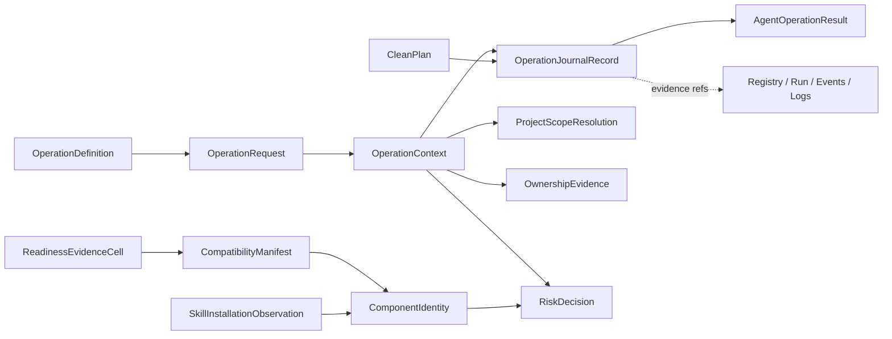
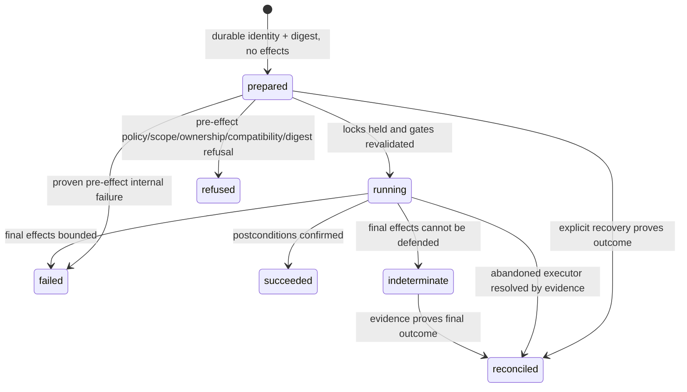

# Data Model: Shared Agent Control Plane

**Status**: Planning complete  
**Source lane**: `planning/handoffs/data-model-state.json`

## Authority Boundary

The Application Kernel owns operation definitions, request normalization, policy decisions, journal transitions, recovery, and normalized Agent results. Existing registry, project runtime state, global run index, ownership proofs, process/port adapters, logs, and events remain the resource-state authorities. The operation journal references those authorities; it does not replace or copy their mutable truth.

All persisted state resolves from the same `LAUNCHDECK_HOME` for standalone CLI, MCP, Codex Plugin, and Claude Plugin. Plugin-local registry, journal, lock, log, event, or run-index state is forbidden.

## Entities

| Entity | Owner | Core purpose and invariants |
| --- | --- | --- |
| `OperationDefinition` | Operation Registry | Stable operation ID/version, schema refs, handler, scope/risk/ownership/compatibility policy, lock scopes, journal/effect model, adapter exposure, and contract cases. Public MCP schemas are strict projections. |
| `OperationRequest` | Adapter decode, then Kernel | Bounded semantic input, project/task refs, trusted host evidence separated from model input, surface/host, transport request ID, and optional known recovery ID. Recovery IDs never nominate new work. |
| `OperationContext` | Kernel | Kernel-issued operation ID, canonical input digest, resolved project/config, risk, ownership, compatibility, ordered locks, and runtime provenance. Policy-sensitive fields are re-evaluated under locks before effects. |
| `AgentOperationResult` | Kernel result normalizer | Exact fields `protocolVersion`, `operation`, `outcome`, `resource`, `effects`, `safety`, `error`, `nextActions`, `provenance`. Outcome and resource lifecycle status remain separate. |
| `EffectsAssessment` | Handler/reconciler | `none`, `confirmed`, `possible`, or `unknown` certainty; bounded declared effect kinds and evidence refs. Possible/unknown effects require reconciliation and prohibit replay. |
| `OperationJournalRecord` | Kernel journal service | Immutable identity/digest/context plus journal state, effect certainty, resource/result refs, timestamps, retention, revision, and bounded error. Durable `prepared` precedes effects. |
| `ProjectScopeResolution` | Kernel over registry | Resolved/missing/ambiguous/conflicting/scope-violation outcome, exact registry project identity, config digest, candidates, and evidence. Plugin install cwd is never a project default. |
| `OwnershipEvidence` | Existing ownership service | Verified/probable/stale/external/unknown confidence from run, PID, listener, liveness, cwd, command, env marker, start time, and spawn proof. Only verified-owned permits mutation. |
| `RiskDecision` | Kernel policy | Current configured/effective risk, surface, decision/reasons, policy version, digest, scope, ownership, compatibility. Public MCP mutations require low risk and all gates. |
| `CompatibilityManifest` | Build/release source | Build identity; independent package/protocol/CLI/state/catalog/Skill/host axes; component digests; operations; migration capabilities. Mismatch fails writes closed. |
| `ComponentIdentity` | Runtime/Skill/Plugin component | Version, build/manifest/runtime/schema/Skill digests, host, observed path, state home, and observation time. Paths are provenance, not trust. |
| `SkillInstallationObservation` | Installer/doctor | Current, legacy, project, and Plugin Skill observations grouped by canonical digest. Identical duplicates have deterministic reporting; divergent copies have no silent winner. |
| `CleanPlan` | Kernel clean planner | Config/project-bound safe target snapshot, refusals, protected evidence, and canonical plan digest. Apply journals, locks, recomputes, then matches the digest. |
| `ObservationCursor` | Bounded observation service | Kind/resource/query binding, high-water snapshot, offset, expiry, and opaque integrity token. Cannot select arbitrary files or turn into permanent follow. |
| `ReadinessEvidenceCell` | Verification/release evidence | Exact build, surface, operations, host/version, OS/architecture, scenario, outcome, evidence, and invalidation keys. A cell proves only its exact dimensions. |

## Core Relationships



## Persistence Layout

```text
<LAUNCHDECK_HOME>/
├── registry/projects.json                         # existing registry v2 authority
├── runtime/runs.json                              # existing run index v1 authority
├── runtime/operations/v1/
│   ├── records/<operationId>.json                 # authoritative atomic journal record
│   ├── results/<operationId>.json                 # optional bounded terminal result blob
│   └── indexes/by-created/<YYYY-MM-DD>.jsonl      # rebuildable correlation index
├── locks/
│   ├── operation-<operationId>.lock
│   └── operation-journal-index.lock
├── events/events.jsonl                            # existing event authority, operation-correlated
└── logs/...                                       # existing log authority
```

The record write protocol is:

1. Acquire `operation-<operationId>`.
2. Atomically persist the new `prepared` record and append one redacted creation-index entry before resource effects.
3. Acquire ordered resource locks and re-read current registry/config/run/ownership/compatibility/clean-plan truth.
4. Persist `running` before the first declared side effect.
5. Execute; atomically replace the record on every transition and append sanitized lifecycle events.
6. Treat the date index as derived. Rebuild it from records when missing/corrupt; index data never authorizes mutation.

## Journal State Machine



Prohibited transitions include terminal-to-running, indeterminate-to-running, creating a second prepared record for one ID, treating a missing/expired recovery ID as new work, and replay across CLI/MCP/Skill fallback.

## Concurrency and Idempotency

Canonical lock order:

1. `operation-<operationId>`
2. registry lock, only for registry mutations
3. `project-<projectId>`
4. `task-<projectId>-<taskRef>`
5. run-index or journal-index as short inner critical sections

The Kernel must converge current synchronous lifecycle locks and asynchronous control-plane locks behind one mutation lock authority. A live owner blocks takeover; a dead-owner takeover permits only inspection/reconciliation, never implicit resume.

Same operation ID plus same digest reads or reconciles the original work. Same ID plus a different digest refuses. Missing/expired IDs refuse. A new request without a recovery ID may create a new operation after normal resource idempotency checks; this is deliberately not an exactly-once guarantee. Restart uses one operation identity across stop/start and links old/new run IDs.

## Lost-Response Recovery

- Known ID: call `operation.get` or `operation.reconcile`.
- Lost ID: call bounded `operation.list` with resolved project, exact operation name, time window, states, and task when applicable.
- A unique candidate may be inspected/reconciled. Zero and multiple matches are explicit non-executing outcomes.
- The public contract limits correlation to a 15-minute window and at most 20 results. The physical journal can retain terminal records for 30 days without exposing a broad public search.
- Neither list nor reconciliation invokes the original handler.

## Retention and Migration

- Initial journal schema is v1 under `runtime/operations/v1`.
- `succeeded`, `failed`, `refused`, and `reconciled` full records default to 30 days from `terminalAt`.
- `prepared`, `running`, and `indeterminate` have no age expiry and remain until evidence-based reconciliation or a separately specified safe administrative resolution.
- Compaction verifies terminal state and `retainUntil` under the index lock; it never infers terminality from age or a dead PID.
- Unsupported newer record versions block writes and retain bounded diagnosis. Future migrations preserve operation ID, digest, original provenance, effects evidence, and reversible migration metadata.
- Registry, project runtime, run index, lock, event, and journal versions stay independent.
- Plugin update/disable/uninstall never invokes state retention or migration as a package-lifecycle side effect.

## Resource and Result Semantics

| Case | Journal | Outcome | Resource | Effects |
| --- | --- | --- | --- | --- |
| Start creates a run | succeeded | succeeded | running/ready | confirmed, changed=true |
| Start finds the same verified run | succeeded | succeeded, `reusedExistingRun=true` | original running/ready run | confirmed, changed=false |
| Port/process is external or unknown | refused | refused | external/unknown owner | none, changed=false |
| Verified stop succeeds | succeeded | succeeded | stopped | confirmed, changed=true |
| Restart stops old run but new start fails | failed | partial | stopped/failed | confirmed, changed=true |
| Foreground task loses completion evidence | indeterminate | indeterminate | unknown/failed as evidenced | possible/unknown; reconcile only |
| Reconcile proves original result | reconciled | current recovery call succeeds; original result retained | observed current resource | none/confirmed from evidence |

## Bounded Observability

Events are redacted before persistence; logs and journal projections are redacted before response. Cursor tokens bind kind, resource, query digest, and a snapshot high-water mark. The public operation contracts cap events/logs and operation correlation; end-of-snapshot returns no cursor, and observing newer data requires a new call.

Operation events include operation/run/project/task correlation, state, outcome code, effect certainty, build identity, and bounded evidence refs. They never contain raw environment values, arbitrary commands, unbounded output, or protocol frames.

## Validation Ownership

- Kernel contract tests: registry definitions, canonical digests, journal transitions, effects certainty, exact result schema, same-ID rules, and expired-ID refusal.
- State/fault tests: crash points around prepared/running/effect/response, atomic replacement, corrupt/newer schema refusal, index rebuild, retention, and dead-owner takeover without replay.
- Run/ownership tests: start contention/reuse, external inspection-only, verified stop, stale mapping, restart partial state, and cross-version takeover.
- Scope/policy tests: missing/ambiguous/conflicting/unregistered targets, no Plugin-cwd default, current low-risk-only MCP, forbidden inputs, and diagnosis-only compatibility mismatch.
- Clean tests: canonical digest, revalidation drift refusal, unsafe target refusal, fault/reconcile, and protected evidence.
- Observation tests: cursor binding, limits/bytes, expiry, high-water behavior, no arbitrary paths/follow, redaction, and malformed records.
- Installer tests: current/legacy/Plugin copies, identical/divergent states, deterministic reporting, and no automatic overwrite/delete.
- Readiness tests: exact host/OS/update/uninstall/recovery cells and refusal to roll up missing evidence.

## Non-Blocking Implementation Gaps

The repository does not yet contain the journal, canonical input digest fixtures, cursor service, compatibility/readiness records, or dual-location non-destructive installer behavior. Current sync and async lifecycle locks also differ. These are implementation tasks under this plan, not reasons to reduce scope or claim existing readiness.
